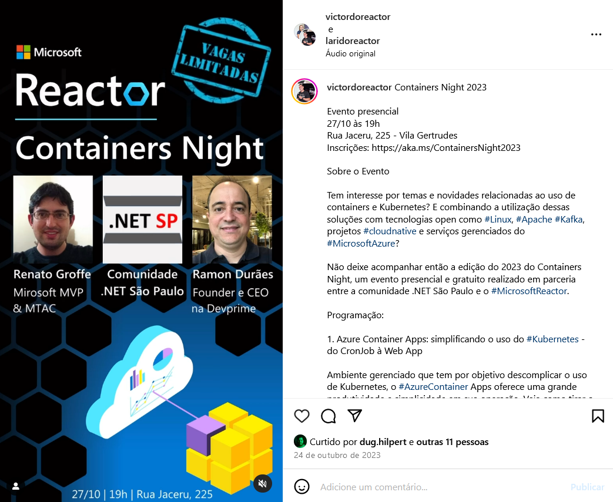
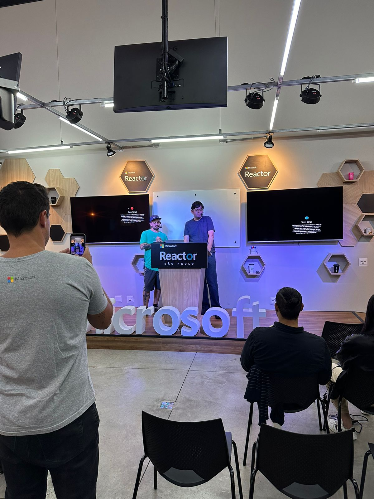
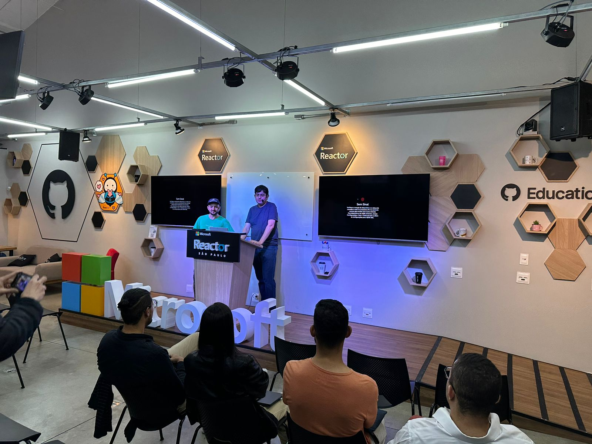
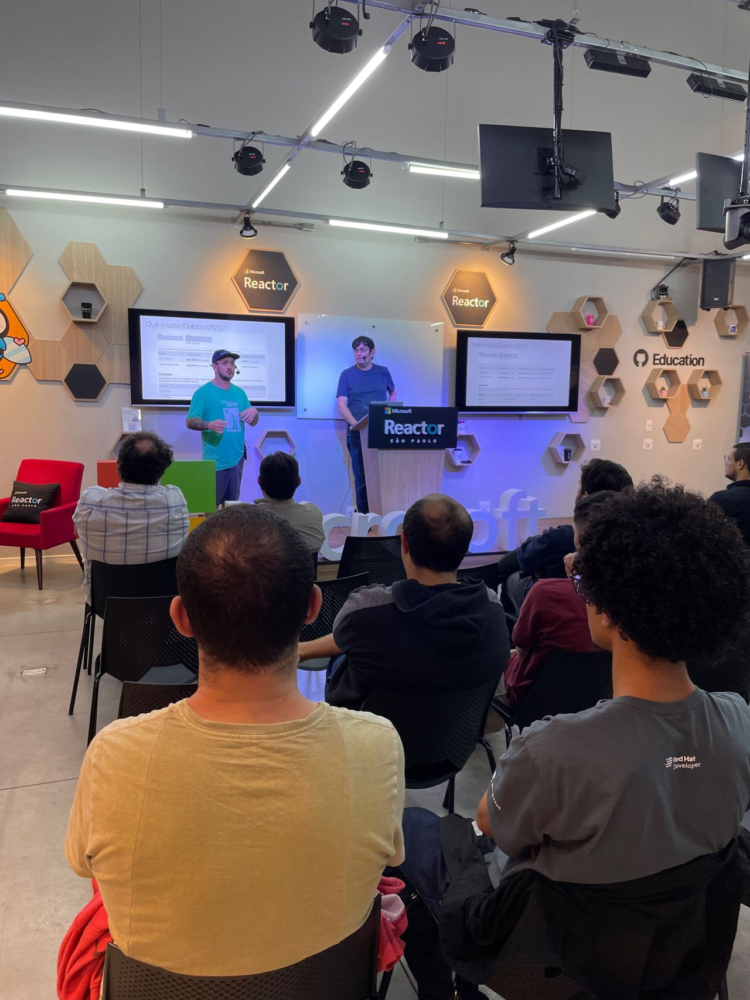
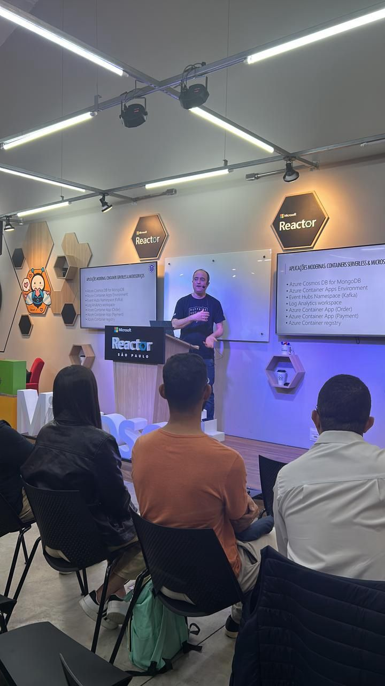
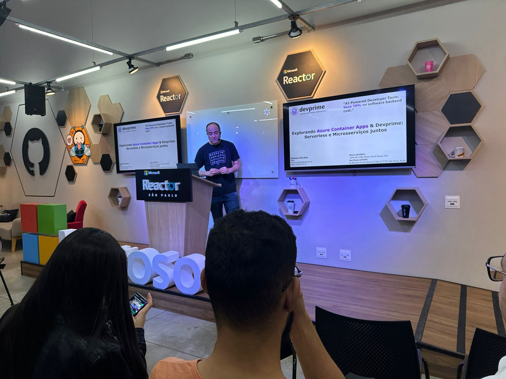
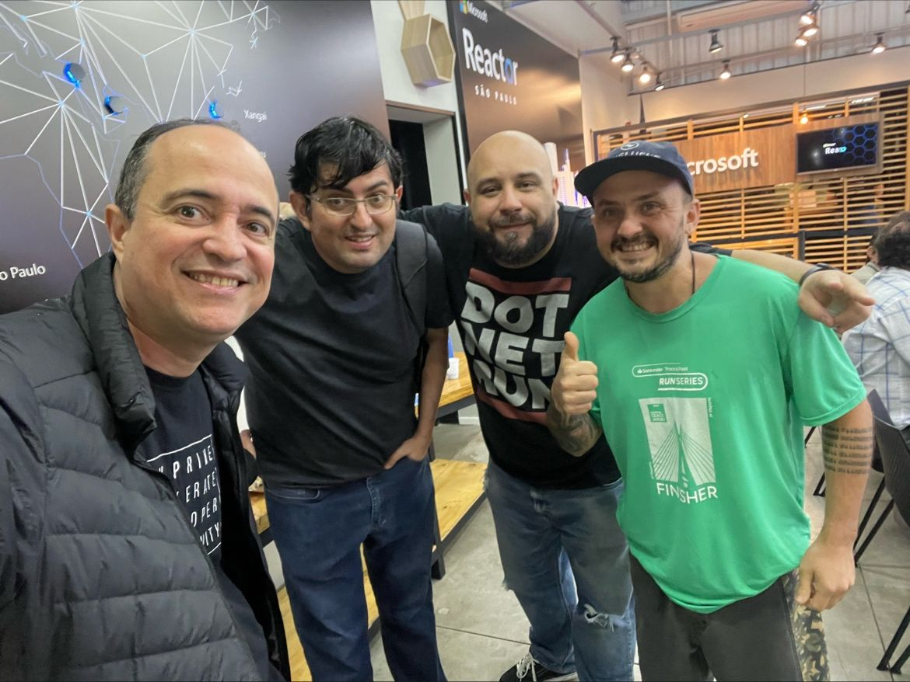

# Containers Night 2023 - São Paulo-SP
Fotos e informações gerais sobre o evento "Containers Night 2023", realizado em 27/10/2023 na cidade de São Paulo-SP.

Organizadores:
- **Renato Groffe (Microsoft MVP, MTAC)**
- **Ramon Durães (Microsoft MVP Reconnect)**

Número de participantes: **16 pessoas**

Apresentações/talks que aconteceram durante o evento:
* **Azure Container Apps: simplificando o uso do Kubernetes - do CronJob à Web App - Renato Groffe (Microsoft MVP, MTAC) e Milton Camara Gomes (Microsoft MVP, MTAC)**

* **Explorando Azure Container Apps & Devprime: Serverless e Microsserviços juntos - Ramon Durães (Microsoft MVP Reconnect)**

Tecnologias abordadas: **Azure Container Apps, Application Insights, Linux, .NET 7, ASP.NET Core, Visual Studio Code, DevPrime**

Acesse este [**link**](/img/) para visualizar todas as fotos das apresentações.

Este evento foi uma parceria entre a comunidade [**.NET SP**](https://www.meetup.com/dotnet-Sao-Paulo/) e o [**Microsoft Reactor**](https://www.meetup.com/Microsoft-Reactor-Sao-Paulo/).

Formulário utilizado para inscrições: [**Microsoft Reactor**](https://developer.microsoft.com/pt-br/reactor/events/20879/?wt.mc_id=1reg_20879_webpage_reactor)

Local: Microsoft Reactor - Rua Jaceru, 225 - Vila Gertrudes - São Paulo - SP - CEP: 04705-000

Deixamos aqui nossos agradecimentos ao Victor Temple e à Larissa Cyganski pela oportunidade e todo o apoio para promovermos esta edição local do .NET Conf no Microsoft Reactor em São Paulo-SP.

---

